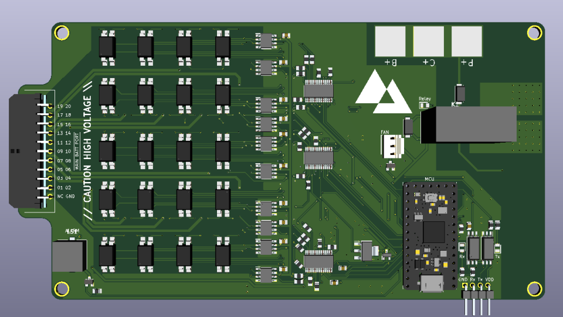
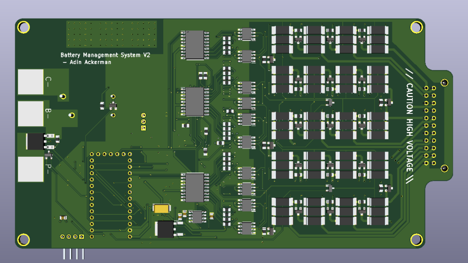

# Custom Battery Management System (SuperBMS)

### Use Case
The purpose of the SuperBMS is to balance, monitor, and protect large lithium batteries intended for use in electric vehicles.

### Features
 - Supports 4-20 Cells
 - 24-bit ADCs
 - Low quiescent current
 - Customizable code (CircuitPython)
 - Automatically detects and identifies faults
 - Electrically isolated serial interface
 - Flexible discharge resistor configuration
 - Power control over charger and load
 - 3-pin fan header
 - Indicator buzzer and LEDs

# How it works

## Fundamental Principle

Lithium batteries that are comprised of multiple lithium batteries in series need to be balanced since the internal resistance of each cell differs, meaning over time the charge of individual cells can drift apart. This is a serious problem if unmanaged since it can cause the voltage of the cells to exceed the safe bounds.

The SuperBMS (like all passive BMS's) uses large resistors to drain cells that charge faster than others, allowing the slower cells to catch up with the faster ones. The BMS ensures that no cell's voltage can get too high or too low.

## Board Design

### Measuring Cells

Measuring batteries that can be up to 84 volts is no easy (or cheap) task.

The SuperBMS employs 20 op-amps ([INA149](https://www.ti.com/lit/ds/symlink/ina149.pdf?ts=1596011892251&ref_url=https%253A%252F%252Fwww.google.com%252F)), one for each cell, to measure the cell voltages. The output of the op-amps is fed into the 3 onboard ADCs ([ADS1248](https://www.ti.com/lit/ds/symlink/ads1248.pdf?ts=1596755210613&ref_url=https%253A%252F%252Fwww.ti.com%252Fproduct%252FADS1248)). A 4.7kOhm resistor is in between each op-amp and the corresponding ADC input to prevent possible damage to the ADC, since the saturation voltage of the op-amps exceeds the ADCs' analog supply voltage.
The ADCs then communicate with the microcontroller, reporting each cell voltage with microvolt accuracy. ([ADS1248 IC Driver](https://github.com/AdinAck/ADS1248-CircuitPython))

### Discharging Cells

The SuperBMS boasts a whopping 80 watts of maximum concurrent discharge ability. 20 pairs of up to 3 SMD resistors are used to discharge individual cells. Depending on the configuration of the user, they may need to be outfitted with heatsinks. The resistors are activated by their corresponding switch circuit that uses a MOSFET and optocoupler to allow a 3.3v signal to easily control the switch. Since there are so many resistors to control, IO expanders ([MCP23008](https://ww1.microchip.com/downloads/en/DeviceDoc/MCP23008-MCP23S08-Data-Sheet-20001919F.pdf)) were used. The outputs of the expanders are latched, so code must be run to deactivate the outputs if the script abruptly ends due to an error or manual exit. (An oversight in this area caused the BMS to catch on fire once). A design improvement would be to connect the enable pin of the IO expanders to a GPIO pin on the microcontroller, acting as a pseudo watchdog, since if the microcontroller errors, the GPIO pins will be pulled down to GND.

### Diagrams

***

